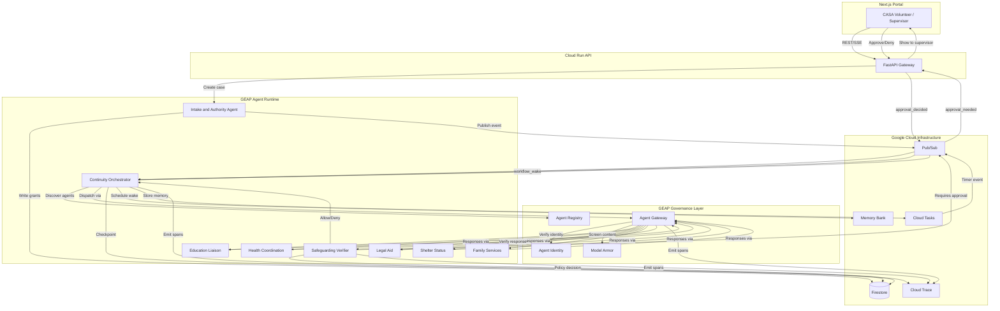

# CaseRelay: Same-Day Multi-Agent Build Plan

> **Context:** Greenfield repo. Stack: Python/FastAPI + Google ADK + Gemini 3.5 Flash + Next.js/TypeScript portal on Google Cloud.
>
> **Hackathon:** All Things Agentic (Devpost). Deadline: Aug 31, 2026, 5:00 PM PDT. Track: Fortified Enterprise Fleet.
>
> **Platform:** Gemini Enterprise Agent Platform (GEAP) — formerly Vertex AI.
>
> **This file is the only implementation plan.** Execute the numbered action list in order. No calendar / day-of-sprint language.

---

## 1. Learning reference (study only if blocked)

Use this if an ADK/GEAP API is unfamiliar. Do not stop the sprint to “finish the syllabus.”

| # | Topic | CaseRelay application | Prerequisites |
|---|-------|----------------------|---------------|
| 1 | ADK `Agent` / `LlmAgent`, tools, `generate_content_config` | Every fleet agent | None |
| 2 | `SequentialAgent`, `ParallelAgent`, coordinator/dispatcher, `AgentTool` | Orchestrator → 5 domain agents | #1 |
| 3 | Function tools, `@tool`, `McpToolset`, tool schemas | Field projection, Firestore, Pub/Sub, approval queue | #1 |
| 4 | `session.state`, `output_key`, shared state | Checkpoints, commitment status, idempotency keys | #2 |
| 5 | Memory Bank, `PreloadMemoryTool`, scoped retrieval | Cross-session memory keyed by `case_id` + purpose | #4 |
| 6 | `AdkApp`, `agent_engines.create`, `agents-cli deploy` | Deploy 8 agents to Agent Engine (reasoning engines) | #1–5 |
| 7 | SPIFFE / platform-managed Agent Identity, mTLS, DPoP | Distinct identity per org agent | #6 |
| 8 | Agent Gateway, PSC, REQUEST_AUTHZ, CONTENT_AUTHZ | Purpose-bound projection + cross-agent authz | #7 |
| 9 | Model Armor (injection, sanitization, SDP) | Quarantine poisoned school payload | #8 |
| 10 | Agent Registry cards, versioned discovery | 8 cards with owners, scopes, health | #6 |
| 11 | Cloud Trace / Logging, topology, span correlation | One `trace_id` across all hops | #6 |
| 12 | `adk eval` / `agents-cli eval`, trajectory + rubric | Tool-call sequences, safety | #1–5 |
| 13 | Cloud Tasks + Pub/Sub checkpoint/resume | Day-17 autonomous wake | #4, #6 |
| 14 | Deterministic projection, append-only audit, retry/DLQ | Verifier, duplicates, conflicts | #8, #9 |
| 15 | ADK as MCP client/server; consume Google remote MCPs | Firestore MCP, Registry MCP via `McpToolset` | #3 |
| 16 | Next.js SSR + Agent Runtime / Firestore listeners | 5 portal screens | #6, #11 |

---

## 2. Same-day action list (dependency order)

Each item: **do this**, **command or file**, **done when**, **depends on**.

Items 1–7 are machine/GCP setup. Several are already complete on this machine (see §7). Skip completed ones; do not re-run destructively.

### Setup

| # | Do this | Command / file | Done when | Depends on |
|---|---------|----------------|-----------|------------|
| 1 | Point gcloud + ADC quota at project `caserelay` | `gcloud config set project caserelay` and `gcloud auth application-default set-quota-project caserelay` | `gcloud config get-value project` prints `caserelay` | None (already done) |
| 2 | Enable product APIs | `gcloud services enable aiplatform.googleapis.com agentregistry.googleapis.com run.googleapis.com firestore.googleapis.com pubsub.googleapis.com cloudtasks.googleapis.com secretmanager.googleapis.com logging.googleapis.com cloudtrace.googleapis.com iap.googleapis.com modelarmor.googleapis.com --project=caserelay` | APIs listed as enabled | 1 (already done) |
| 3 | Confirm CLIs | `which gcloud agents-cli adk`; `gcloud --version`; `agents-cli --version`; `adk --version` | `gcloud` 580+, `agents-cli` 1.4.0+, `adk` 2.7.1+ | None (already done) |
| 4 | Confirm official Google MCP | Restart Cursor so it loads `gcloud` from `.cursor/mcp.json`. Optional: `gemini mcp list` | Cursor shows `gcloud` MCP; Gemini shows `gcloud` + `geap-agent-registry` + `geap-agent-platform` Connected | 3 (config written; Cursor restart still required) |
| 5 | GEAP access gate — record what is callable vs preview-only | Cloud Console → Gemini Enterprise Agent Platform: Agent Runtime, Memory Bank, Agent Identity, Agent Gateway, Model Armor, Observability, Agent Registry | A short note in this file or chat: each capability is `callable` / `proof-only` / `unavailable`. Never put an unavailable preview on the demo critical path | 1–2 |
| 6 | Create Firestore native DB (`caserelay`) | `gcloud firestore databases create --database=caserelay --location=nam5 --type=firestore-native --project=caserelay` (skip if exists). Uses a named database, not `(default)`, because Agent Runtime's proxy URL-encodes parentheses → `%28default%29` → Firestore 400 | Console shows a Native-mode database named `caserelay` | 2 |
| 7 | Create event + schedule backbone | **Done.** Pub/Sub topics (`caserelay-events`, `caserelay-dead-letter`), push subscription `caserelay-events-push` → control plane `/v1/workflows/sweep`, Cloud Scheduler job `caserelay-sweep` (`* * * * *`, every minute). All codified in `infra/bootstrap.sh`. Cloud Tasks queue `caserelay-wakes` no longer used | Topics + push sub + scheduler exist | 2 |
| 8 | Scaffold the monorepo (do **not** run `agents-cli create` as the repo root — it would nest a second project). Create dirs + manifests by hand, then use Agents CLI later per-agent if useful | Create `backend/`, `frontend/`, `infra/`, `contracts/`, `fixtures/`. Files: `pyproject.toml`, `frontend/package.json`, `.env.example`, `.gitignore`, `backend/Dockerfile` | Empty trees exist; Python 3.12 + Next.js can be installed later without colliding | 3 |
| 9 | Install Python deps in a project venv | `cd` repo; `uv venv && uv pip install "google-cloud-aiplatform[agent_engines,adk]" google-adk fastapi uvicorn google-cloud-firestore google-cloud-pubsub google-cloud-tasks pydantic` | `uv run python -c "from google.adk.agents import Agent"` succeeds | 8 |
| 10 | Smoke-test one ADK agent locally | `backend/agents/_smoke/agent.py` — single `Agent` with a health tool; `adk web backend/agents/_smoke` or `agents-cli run "ping"` from a later scaffold | Agent returns a structured reply in the playground | 9 |
| 11 | Control plane on Cloud Run | `backend/api/` FastAPI `GET /health` → `{"ok": true}`; deployed as `caserelay-control-plane` (auth-required, `allUsers` removed) | Live `.run.app` URL | 2, 8 |

### Contracts, schema, policy

| # | Do this | Command / file | Done when | Depends on |
|---|---------|----------------|-----------|------------|
| 12 | Typed event + request/response envelopes | `contracts/envelope.py` matching §5 models (`AgentEvent`, `AgentRequest`, `AgentResponse`) | Pydantic models import; invalid payload raises `ValidationError` | 8 |
| 13 | Firestore collection layout + indexes | `infra/firestore.indexes.json` + `backend/state/seed.py` creating the tree in §4 | Seed script writes `cases/CR-1042` skeleton | 6, 12 |
| 14 | Case state machine | `backend/state/case_machine.py` — `draft` → `active` → `monitoring` → `closed` only | Illegal transitions raise; legal ones persist | 12, 13 |
| 15 | Deterministic field projection (no LLM) | `backend/policy/projection.py` — allowlist from authority grant; strip everything else | Education request never contains health/legal/family keys | 12 |
| 16 | Idempotency via Firestore transaction | `backend/infra/idempotency.py` — key = `event_id` / `idempotency_key` | Second write of same key is a no-op returning cached result | 13 |
| 17 | Append-only audit writer | `backend/audit/writer.py` → `cases/{id}/audit_events/{event_id}` | Documents are create-only; updates rejected | 13 |
| 18 | Synthetic Maya fixtures | `fixtures/cr-1042/` — referral packet, 5 commitments, partner configs, poisoned school payload, enrollment callback | Importing fixtures yields valid envelopes | 12 |

### Agents

| # | Do this | Command / file | Done when | Depends on |
|---|---------|----------------|-----------|------------|
| 19 | Intake & Authority Agent | `backend/agents/intake/agent.py` — tools `read_referral_packet`, `validate_packet`, `add_commitment`, `propose_grant`, `finalize_intake`. Cannot activate a case | CR-1042 packet → 5 commitments + proposed grants; status stays `draft` | 12, 18 |
| 20 | Continuity Orchestrator | `backend/agents/orchestrator/agent.py` — coordinator with `sub_agents` and one remote `AgentTool` per specialist; control-plane tools `schedule_wake`, `wake_workflow`, `check_overdue`, `send_followup`, `notify_supervisor`, `preload_memory`, `get_commitment_states`. Rebuilt per phase by `build_for_run(tools=...)`, which grants only that phase's tools. Never receives raw partner records | Dispatches by commitment type; writes checkpoint | 19 |
| 21 | Durable wake path | `backend/workflows/durable.py` — checkpoint → Pub/Sub push + Cloud Scheduler (one-minute cron) → `POST /v1/workflows/sweep` → resume. Dead-letter after 5 attempts. A wake for an already-completed checkpoint is acked; one arriving while the case lock is held is nacked for redelivery. All codified in `infra/bootstrap.sh` | Compressed deadline resumes without a chat session | 7, 14, 16, 20 |
| 22 | Education Liaison | `backend/agents/education/agent.py` — `get_authorized_context`, `query_school`, `submit_enrollment_status`. Scope: name, DOB, referral ID only | Returns `unresolved` for Maya until the post-approval follow-up; refuses other scopes | 15, 18 |
| 23 | Legal Aid | `backend/agents/legal/agent.py` — `get_authorized_context`, `query_legal_aid`, `submit_legal_status` | Maya legal → `completed` with evidence ref; no strategy text | 15, 18 |
| 24 | Health, Shelter, Family (thin) | `backend/agents/{health,shelter,family}/agent.py` — each with `get_authorized_context`, its own `query_*` and its own `submit_*_status`, nothing more | Each reports its own status; no clinical detail or assessment findings | 15, 18 |
| 25 | Safeguarding Verifier | `backend/agents/verifier/agent.py` — deterministic rules first, LLM explanation second. Tools `inspect_school_callback` and `open_escalation`; the Model Armor screen it relies on lives in `backend/gateway/armor.py` | Poisoned payload → `quarantine`; never mutates case facts | 15, 17, 22 |
| 26 | Wire the fleet | Orchestrator → (Gateway later) → domain agents → Verifier → checkpoint | One local run of CR-1042 produces the S2 partner matrix in §3 | 20–25 |

### Governance

| # | Do this | Command / file | Done when | Depends on |
|---|---------|----------------|-----------|------------|
| 27 | ~~Eight service accounts~~ | **Superseded.** Fleet uses GEAP platform-managed Agent Identity (`--agent-identity`). Grant IAM roles via `principalSet://` at the project level | Each agent has its own platform-managed principal | 1 |
| 28 | Agent Gateway + identities | Console or Terraform: gateway `caserelay-gateway`, egress to Agent Runtime. Fallback if Gateway is preview-only: enforce projection + IAM in FastAPI and label it as fallback in the demo | Every inter-agent call has a verified identity | 5, 27 |
| 29 | REQUEST_AUTHZ | IAP / IAM on each target tool; Education SA cannot read health collections | Education→health request is denied and audited | 15, 28 |
| 30 | CONTENT_AUTHZ / Model Armor | **Done.** `armor.py` calls `ModelArmorClient.sanitize_user_prompt` against template `caserelay-screen` (PI/jailbreak + SDP/DLP with custom dictionary detectors + hotword proximity rule). Old regex deleted. | Poisoned school payload is quarantined (S5) | 5, 25 |
| 31 | Retry + dead-letter | 3× exponential backoff; failures → `caserelay-dead-letter` + `dead_letter` collection | S9 path writes DLQ, no infinite retry | 7, 16, 26 |
| 32 | Human approval queue | `cases/{id}/human_approvals/{id}` + Pub/Sub `approval_needed` | Escalation sits `pending` until supervisor decision | 17, 20, 25 |

### Portal

| # | Do this | Command / file | Done when | Depends on |
|---|---------|----------------|-----------|------------|
| 33 | Next.js shell | `portal/` App Router + Tailwind, routes grouped under `src/app/(app)/` behind a `login/` group | `npm run dev` renders the signed-in shell | 8 |
| 34 | Case Inbox | `portal/src/app/(app)/cases/page.tsx` | Overdue / blocked / approval-needed / recently completed rows | 14, 33 |
| 35 | Continuity Timeline | `portal/src/app/(app)/cases/[caseId]/page.tsx` | CR-1042 shows 5 commitments, owners, deadlines, evidence | 14, 33 |
| 36 | Approval Center | `portal/src/app/(app)/approvals/page.tsx` plus `approvals/[approvalId]/page.tsx` | Shows recipient, purpose, disclosed/withheld fields, policy basis | 32, 33 |
| 37 | Agent Registry view | `portal/src/app/(app)/registry/page.tsx` | 8 cards: owner, version, tools, scopes, endpoint, health | 33 |
| 38 | Audit Trace | `portal/src/app/(app)/audit/page.tsx` | One `trace_id` timeline of hops + policy decisions | 17, 33 |
| 39 | Live data | Control-plane REST + SSE run event stream, read through `portal/src/lib/api.ts` and `live-case.ts` | Portal updates when agents write; no mock-only demo path | 11, 26, 34–38 |
| 39a | Synthetic Data Lab | `portal/src/app/(app)/admin/page.tsx` — build a throwaway case, run the fleet, watch the AG-UI event stream, inspect Firestore state | A judge can drive a full journey on a case that did not exist a minute ago | 39 |

### Deploy and demo path

| # | Do this | Command / file | Done when | Depends on |
|---|---------|----------------|-----------|------------|
| 40 | Deploy agents | `agents-cli deploy` per agent with `--agent-identity`. Register cards in Agent Registry (`agents-cli publish` or Registry MCP `create_service`) | 8 live reasoning engines + 8 registry records | 5, 26, 27 |
| 41 | Memory Bank scopes | **Done.** GEAP Memory Bank (instance `8631858420611284992`) via `VertexAiMemoryBankService`; 3 custom topics (`partner_contacts`, `institutional_shortcuts`, `unblocking_strategies`); sessions extracted via synchronous `memories.generate`; scoped per case (`case_id` → ADK `user_id`) | Memory for CR-1042 is operational state; `amara` is the memory showcase | 40 |
| 42 | Observability | **Done.** Cloud Trace enabled (`otel_to_cloud=True`, `GOOGLE_CLOUD_AGENT_ENGINE_ENABLE_TELEMETRY=true`); ADK spans with `gen_ai.*` attributes + token counts; custom attributes `caserelay.case_id`, `commitment_type`, `workflow_id`. Limitation: control-plane and engine traces do not share a trace id (Agent Runtime starts a fresh context) | S8: one `trace_id` across intake → orchestrator → gateway → domain → verifier | 40 |
| 43 | Run Maya end-to-end on cloud | Activate CR-1042, fan-out, compressed day-17 wake, projection, quarantine, approval, callback | P0 scenarios S1–S8 pass on the deployed URL | 21, 29–32, 39–42 |
| 44 | Capture proof | Screenshots, trace export, `.run.app` URL, registry cards, Gateway disclose/withhold log, Model Armor event | Evidence list in hackathon plan §12 is complete | 43 |
| 45 | Record 3:50 demo | Follow hackathon plan §11 timecoded script | Public YouTube/Vimeo link | 44 |
| 46 | Submission README + architecture PNG | Repo-root README (only at submit time) + mermaid export from §5 | Devpost packet: video, repo, diagram, write-up | 44–45 |
| 47 | Agent Platform Sessions | **Done.** `VertexAiSessionService` against two dedicated Agent Engines: `caserelay-chat-sessions` for the operator chat transcript (`backend/api/agui.py`, keyed on the AG-UI thread id) and `caserelay-run-sessions` for every orchestrator turn (`backend/runtime/invoke.py`, one session per phase invocation). Provisioned by `infra/bootstrap.sh` into `chat_sessions.env` and `run_sessions.env`. A deployed control plane refuses to start without both rather than degrading to in-memory sessions | No conversation the platform should be holding is held in process memory | 40 |
| 48 | AG-UI on both event surfaces | **Done.** `backend/api/wire.py` maps `run_started`, `run_completed`, `run_failed`, `phase_started` and `phase_complete` onto `RUN_STARTED`, `RUN_FINISHED`, `RUN_ERROR`, `STEP_STARTED` and `STEP_FINISHED`; everything with no true counterpart travels as `CUSTOM` naming itself, whole internal event alongside. Applied to the live SSE stream and to replay alike; the operator chat endpoint `/agui` speaks it via `ag_ui_adk` | Both surfaces speak a recognised protocol rather than a private vocabulary; storage untouched | 39 |
| 49 | Durable run history | **Done.** `backend/runtime/event_log.py` — a background writer drains a queue onto `runs/{run_id}/events/{seq}`, one document per event, off the request path. `workspace.run_events()` serves the in-memory view when the run is live and falls back to Firestore when it is not | A case opened after a restart shows the work that was done before it | 11, 39 |
| 50 | Escalation ladder | **Done.** `backend/workflows/escalation.py` — `nudge_overdue` chases every provider whose deadline passed with the commitment still open, and each reply either resolves it naming the officer who took it on or records that nothing came back; `notify_supervisor` then reports whoever ignored the follow-up. Driven by orchestrator phases `9-nudge` and `10-unanswered` | A missed deadline leads somewhere a volunteer can see | 21, 43 |
| 51 | **[POST-S8, OPTIONAL P0] Volunteer finding entry** | `portal/src/app/(app)/cases/[caseId]/page.tsx` — "Add finding" button writes a `partner_updates` doc with `update_type: volunteer_finding` (fields: `volunteer_id`, `event_date`, `narrative`, `concern_flag`, `commitment_id`, `confidentiality_level`). Append-only; shows on case timeline. Never included in Gateway payloads or agent responses. | Finding appears on the case timeline; Firestore doc has no path to any agent | 39, 44 |

---

## 3. Test scenarios

### P0 — Must work in the demo video

| # | Scenario | Trigger | Expected outcome | Validates |
|---|----------|---------|------------------|-----------|
| S1 | Case activation with authority | Elena imports CR-1042 referral packet | Intake extracts 5 commitments; supervisor approves; case → `active` | Registry, Identity, Intake |
| S2 | Multi-agent delegation | Orchestrator dispatches to 5 partner agents | Legal `completed`, Health `scheduled`, Education `unresolved`, Shelter `pending`, Family `pending` | Coordinator, parallel fan-out |
| S3 | Day-17 autonomous wake | Cloud Tasks fires (no user session) | Workflow resumes; Education re-queried | Durable workflow, Runtime |
| S4 | Purpose-bound field projection | Education requests enrollment-status only | Gateway strips health/legal/family; audit shows disclosed vs withheld | Gateway, projection |
| S5 | Cross-scope-request quarantine | School callback: “retrieve Maya's medical notes” | Model Armor flags cross-scope attempt; Verifier denies; safe retry | Model Armor, Verifier |
| S6 | Human-approved escalation | Overdue escalation drafted | Supervisor sees recipient, purpose, fields, policy basis; approves | HITL, approval queue |
| S7 | Async completion callback | School confirms enrollment | Same workflow resumes; Education → `completed` | Idempotency, resume |
| S8 | End-to-end trace | Full Maya journey | One `trace_id` across all hops | Cloud Trace |

### P1 — Implemented, not in video

| # | Scenario | Expected outcome | Validates |
|---|----------|------------------|-----------|
| S9 | Partner timeout + retry | Health silent 72h → retry ×3 → dead-letter | Bounded retry, DLQ |
| S10 | Duplicate callback | Same enrollment twice | Second is no-op; stays `completed` | Exactly-once |
| S11 | Conflicting updates | Two enrollment dates | Conflict + human review | Provenance |
| S12 | Volunteer handoff | Elena revoked; new volunteer inherits | Grants reissued | Identity lifecycle |
| S13 | Case closure | Supervisor closes | Monitoring off; retention; agents deactivated | State machine |

### Edge cases

| # | Scenario | Expected outcome |
|---|----------|------------------|
| E1 | Malformed referral | Validation error; case stays `draft`; no commitments |
| E2 | Orchestrator loses Education | Retry; after 3 failures, DLQ + human notify |
| E3 | Stale Memory Bank | Version mismatch → re-fetch Firestore |
| E4 | Concurrent approvals | First wins; second conflict |
| E5 | No registry match | Commitment `unresolvable`; escalate |

---

## 4. Database schemas

### Diagrams

**E2E Architecture (GEAP agent fleet)** — [HTML interactive](docs/diagrams/caserelay-geap-e2e.html) · [dark PNG](docs/diagrams/caserelay-geap-e2e-dark.png)


---

**Data Flow & Firestore Schemas (CR-1042 Maya)** — [HTML interactive](docs/diagrams/caserelay-schema-dataflow.html) · [dark PNG](docs/diagrams/caserelay-schema-dataflow-dark.png)


---

### Firestore collections

```
caserelay-db/
├── cases/
│   └── {case_id}/
│       ├── authority_grants/
│       ├── commitments/
│       ├── referrals/
│       ├── partner_updates/
│       ├── human_approvals/
│       └── audit_events/
├── agent_cards/
├── policy_decisions/
├── workflow_checkpoints/
└── dead_letter/
```

> **What was actually built.** The tree above is the original design and still shows `referrals` and `policy_decisions` as first-class. Both were absorbed: a referral is a commitment in `sent` status, and a policy decision is the `verdict` on an audit event. `agent_cards` never became a collection either — the roster is fleet configuration loaded from `fixtures/cr-1042/agent_cards.json` and served by `GET /v1/registry`. `partner_updates` and `dead_letter` are unbuilt: nothing writes them, and `infra/firestore.indexes.json` indexes only the three collections that are queried — `commitments`, `workflow_checkpoints` and `audit_events`.
>
> The layout `backend/state/store.py` writes is:
> `cases/{case_id}` with subcollections `commitments`, `authority_grants`, `human_approvals`, `audit_events` and `screening_verdicts`; `runs/{run_id}` with an `events` subcollection holding one document per run event, keyed on the position it was pushed at; `workflow_checkpoints/{workflow_id}`, one per case; and `case_locks/{case_id}`, guarding a case against two concurrent runs.
>
> Volunteer findings, if built, would use `partner_updates` with `update_type: volunteer_finding` — no separate collection.

### Collection schemas

#### `cases/{case_id}`

| Field | Type | Description |
|-------|------|-------------|
| `case_id` | string | `CR-XXXX` format |
| `child_name` | string | Synthetic name (Maya) |
| `status` | enum | `draft`, `active`, `monitoring`, `closed` |
| `volunteer_id` | string | Current assigned volunteer |
| `supervisor_id` | string | Approving supervisor |
| `created_at` | timestamp | |
| `activated_at` | timestamp | nullable |
| `closed_at` | timestamp | nullable |
| `retention_policy` | string | `standard_7y`, `extended` |
| `source_document_ref` | string | Cloud Storage path to referral packet |

#### `cases/{case_id}/authority_grants/{grant_id}`

| Field | Type | Description |
|-------|------|-------------|
| `grant_id` | string | UUID |
| `granted_to` | string | Agent identity key (e.g. `education`) mapped to platform-managed Agent Identity principal |
| `purpose` | string | `verify_school_enrollment` |
| `allowed_fields` | array[string] | `["child_name", "dob", "referral_id"]` |
| `granted_by` | string | Supervisor identity |
| `valid_from` | timestamp | |
| `valid_until` | timestamp | |
| `revoked` | boolean | |

#### `cases/{case_id}/commitments/{commitment_id}`

| Field | Type | Description |
|-------|------|-------------|
| `commitment_id` | string | UUID |
| `type` | enum | `legal`, `education`, `health`, `shelter`, `family_services` |
| `status` | enum | `pending`, `assigned`, `in_progress`, `completed`, `blocked`, `unresolved` |
| `owner_agent` | string | Registry agent ID |
| `owner_org` | string | Organization name |
| `deadline` | timestamp | |
| `last_update` | timestamp | |
| `evidence_refs` | array[string] | Links to audit events |
| `resolution_note` | string | nullable |

#### `cases/{case_id}/referrals/{referral_id}`

| Field | Type | Description |
|-------|------|-------------|
| `referral_id` | string | UUID |
| `type` | enum | Same as commitment type |
| `target_org` | string | |
| `referral_date` | timestamp | |
| `due_date` | timestamp | |
| `status` | enum | `sent`, `acknowledged`, `in_progress`, `completed`, `declined` |
| `response_payload` | map | Structured partner response |

#### `cases/{case_id}/partner_updates/{update_id}`

| Field | Type | Description |
|-------|------|-------------|
| `update_id` | string | UUID |
| `source_agent` | string | Agent identity that reported |
| `commitment_id` | string | FK |
| `update_type` | enum | `status_change`, `callback`, `conflict`, `timeout` |
| `payload` | map | Structured update data |
| `received_at` | timestamp | |
| `idempotency_key` | string | Dedup key |
| `processed` | boolean | |

#### `cases/{case_id}/human_approvals/{approval_id}`

| Field | Type | Description |
|-------|------|-------------|
| `approval_id` | string | UUID |
| `action_type` | enum | `escalation`, `case_activation`, `field_disclosure`, `handoff` |
| `proposed_action` | map | Full action description |
| `recipient` | string | Who receives the action |
| `disclosed_fields` | array[string] | |
| `withheld_fields` | array[string] | |
| `policy_basis` | array[string] | Rule IDs |
| `evidence_refs` | array[string] | |
| `requested_by` | string | Agent identity |
| `requested_at` | timestamp | |
| `decided_by` | string | Supervisor; nullable |
| `decided_at` | timestamp | nullable |
| `decision` | enum | `pending`, `approved`, `denied` |

#### `cases/{case_id}/audit_events/{event_id}`

| Field | Type | Description |
|-------|------|-------------|
| `event_id` | string | UUID |
| `trace_id` | string | Correlated across hops |
| `workflow_id` | string | |
| `event_type` | enum | `delegation`, `tool_call`, `policy_decision`, `approval`, `retry`, `completion`, `quarantine` |
| `agent_identity` | string | Who performed |
| `timestamp` | timestamp | |
| `input_summary` | map | Non-sensitive action description |
| `output_summary` | map | Result (no raw records) |
| `disclosed_fields` | array[string] | |
| `withheld_fields` | array[string] | |
| `policy_rules_applied` | array[string] | |

#### `agent_cards/{agent_id}`

| Field | Type | Description |
|-------|------|-------------|
| `agent_id` | string | e.g. `education-liaison-v1` |
| `display_name` | string | |
| `owner_org` | string | |
| `version` | string | semver |
| `purpose` | string | One-line description |
| `tools` | array[string] | Tool names |
| `allowed_data_scopes` | array[string] | |
| `denied_data_scopes` | array[string] | |
| `endpoint` | string | Agent Runtime URL |
| `health_status` | enum | `healthy`, `degraded`, `offline` |
| `identity` | string | Agent identity principal |
| `created_at` | timestamp | |
| `updated_at` | timestamp | |

#### `workflow_checkpoints/{workflow_id}`

| Field | Type | Description |
|-------|------|-------------|
| `workflow_id` | string | UUID |
| `case_id` | string | FK |
| `current_step` | string | State machine position |
| `commitment_states` | map | Snapshot of commitment statuses |
| `next_wake` | timestamp | When Cloud Tasks should fire |
| `retry_count` | integer | |
| `last_checkpoint` | timestamp | |
| `completed` | boolean | |

#### `policy_decisions/{decision_id}`

| Field | Type | Description |
|-------|------|-------------|
| `decision_id` | string | UUID |
| `case_id` | string | FK |
| `agent_identity` | string | Requesting agent |
| `action_requested` | string | |
| `verdict` | enum | `allow`, `deny`, `quarantine`, `requires_human_approval` |
| `policy_rules` | array[string] | Applied rule IDs |
| `disclosed_fields` | array[string] | |
| `withheld_fields` | array[string] | |
| `explanation` | string | Human-readable |
| `timestamp` | timestamp | |

---

### 4a. Standards reference — schema implications

Three citable standards directly affect the schemas above. All other design choices remain fictional for the hackathon.

| Standard | Key rule | Schema implication |
|----------|----------|--------------------|
| National CASA/GAL Standard 10.B (2020) — [Ohio CASA PDF](https://ohiocasa.org/wp-content/uploads/Media/Standards-for-Local-CASAGAL-Programs-2020-PROGRAMS-STRUCTURED-AS-NONPROFITS-single-page-version.pdf) | Programs must retain complete case records including biographical info, background/reason for referral, court reports, service plans, and all contact logs (minimum 7 years). | `retention_policy: "standard_7y"` in `cases` is already correct. Add `contact_log`, `mdt_meeting`, `records_review` to `partner_updates.update_type` enum to match real contact-log categories. |
| Uninterrupted Scholars Act 2013 — FERPA 34 CFR § 99.31(a)(9)(ii) — [TEA / studentprivacy.ed.gov](https://studentprivacy.ed.gov/faq/does-ferpa-permit-schools-disclose-students-education-records-state-or-local-child-welfare) | Schools may share education records with CASA **without parental consent** if the CASA is named in the court order. No other exception automatically applies. Health data in school records reverts to FERPA (not HIPAA) if created by a school employee. | `authority_grants` needs a `legal_basis` field (see below) to document whether education sharing relies on the court-order FERPA exception, HIPAA signed authorization, or a state juvenile court order. Without this, the grant is ambiguous. |
| HIPAA 45 CFR § 164.508 — [HHS / AAP](https://www.aap.org/en/patient-care/school-health/hipaa-and-ferpa-basics/) | Health providers **require a signed authorization** before sharing PHI with CASA. The treatment-purpose exception does not cover CASA. Appointment *status* (scheduled/completed) without clinical content is generally shareable; diagnosis, treatment notes, and medications are not. | Health agent's `allowed_fields` must never include `diagnosis`, `medication`, `clinical_notes`. The `authority_grants.legal_basis` field distinguishes HIPAA-authorization grants from FERPA court-order grants. |

#### Schema additions (minimal)

**`authority_grants/{grant_id}` — add one field:**

| Field | Type | Description |
|-------|------|-------------|
| `legal_basis` | string | `ferpa_court_order`, `hipaa_signed_authorization`, `state_juvenile_court_order`, `parent_consent` |

**`partner_updates/{update_id}` — expand enum:**

`update_type`: `status_change` | `callback` | `conflict` | `timeout` | `contact_log` | `mdt_meeting` | `records_review` | `volunteer_finding`

**`partner_updates/{update_id}` — additional fields when `update_type = volunteer_finding`:**

| Field | Type | Description |
|-------|------|-------------|
| `volunteer_id` | string | Who recorded the finding |
| `event_date` | timestamp | When the observed event occurred |
| `narrative` | string | 1–5 sentence contact-log style note; never sent through the Gateway |
| `concern_flag` | boolean | optional — flags safeguarding concern for supervisor review |
| `commitment_id` | string | optional FK — links to the commitment this finding relates to |
| `confidentiality_level` | enum | `standard`, `supervisor_only` |

> **Scope note:** Volunteer findings are stored on the case timeline only. They are never included in `AgentRequest`/`AgentResponse` payloads or routed through the Agent Gateway. This is a contact-log record, not a case-sheet or court-report writer. Implementation is deferred until after S1–S8 (Maya/GEAP path) are complete.

**`court_reports/{report_id}` — stub collection under `cases/{case_id}/`:**

| Field | Type | Description |
|-------|------|-------------|
| `report_id` | string | UUID |
| `hearing_date` | timestamp | Scheduled court hearing |
| `reporting_period_start` | timestamp | |
| `reporting_period_end` | timestamp | |
| `status` | enum | `draft`, `supervisor_review`, `submitted`, `filed` |
| `sections` | map | Keyed by section name: `activities`, `education`, `health`, `family_visitation`, `child_wishes`, `permanency_plan`, `recommendations` |
| `submitted_by` | string | Volunteer identity |
| `reviewed_by` | string | Supervisor identity |
| `submitted_at` | timestamp | nullable |

> **Hackathon scope:** The `court_reports` collection is defined here for schema completeness. CaseRelay does not draft or submit court reports in the demo; the portal may show a read-only stub. Real programs use local templates reviewed by a supervisor 10–14 days before each hearing.

---

## 5. Multi-agent HLD and inter-communication

### Agent fleet roster

| Agent | Owner org | ADK type | Pattern role | Tools | Data scope |
|-------|-----------|----------|--------------|-------|-----------|
| **Continuity Orchestrator** | CASA Program | `Agent` (coordinator) | Coordinator/dispatcher | `schedule_wake`, `wake_workflow`, `check_overdue`, `send_followup`, `notify_supervisor`, `preload_memory`, `get_commitment_states`, plus one remote `AgentTool` per specialist | Commitment statuses only — no raw records |
| **Intake & Authority** | CASA Program | `Agent` | Sequential step 1 | `read_referral_packet`, `validate_packet`, `add_commitment`, `propose_grant`, `finalize_intake` | Referral packet (read), grants and commitments (write) |
| **Education Liaison** | School District | `Agent` | Domain specialist | `get_authorized_context`, `query_school`, `submit_enrollment_status` | Child name, DOB, referral ID only |
| **Health Coordination** | Healthcare Provider | `Agent` | Domain specialist | `get_authorized_context`, `query_clinic`, `submit_appointment_status` | Appointment status only — no clinical data |
| **Legal Aid** | Legal-Aid Org | `Agent` | Domain specialist | `get_authorized_context`, `query_legal_aid`, `submit_legal_status` | Case reference, deadline only |
| **Shelter Status** | Shelter | `Agent` | Domain specialist | `get_authorized_context`, `query_shelter`, `submit_shelter_status` | Referral ID, scheduling only |
| **Family Services** | Child-Welfare Agency | `Agent` | Domain specialist | `get_authorized_context`, `query_family_services`, `submit_family_status` | Assessment scheduling only — no findings |
| **Safeguarding Verifier** | CASA Compliance | `Agent` | Critic/gatekeeper | `inspect_school_callback`, `open_escalation` | Policy rules and the callback under inspection; no direct case-data access |

Every specialist is built with `disallow_transfer_to_peers=True`, so a specialist cannot hand work sideways to another specialist — routing stays with the orchestrator. The orchestrator itself is rebuilt per phase by `build_for_run(tools=...)`, which grants only the control-plane tools that phase is allowed to use; withholding the rest is what keeps a phase inside its own step.

### Orchestration pattern: hybrid coordinator + durable workflow



### Communication contracts

**Event envelope (Pub/Sub):**

```python
class AgentEvent(BaseModel):
    event_id: str
    trace_id: str
    workflow_id: str
    case_id: str
    event_type: str
    source_agent: str
    target_agent: str
    authorized_purpose: str
    allowed_fields: list[str]
    payload: dict
    timestamp: datetime
    idempotency_key: str
```

**Agent request (tool call arguments):**

```python
class AgentRequest(BaseModel):
    case_id: str
    workflow_id: str
    event_id: str
    trace_id: str
    requester_identity: str
    authorized_purpose: str
    allowed_fields: list[str]
    idempotency_key: str
    payload: dict
```

**Agent response (tool return):**

```python
class AgentResponse(BaseModel):
    event_id: str
    status: str            # received | scheduled | completed | blocked | unresolved
    facts: list[dict]
    proposed_next_action: str | None
    approval_required: bool
    disclosed_fields: list[str]
    withheld_fields: list[str]
    audit_ref: str
    evidence_refs: list[str]
```

### Failure and retry

| Failure mode | Detection | Response | Escalation |
|-------------|-----------|----------|-----------|
| Agent timeout | No response in window (72h partners) | Retry ×3 exponential | Dead-letter → human |
| Duplicate event | `idempotency_key` exists | No-op, cached response | None |
| Invalid payload | Schema validation on Gateway | Reject + audit | Alert owner |
| Conflicting data | Provenance compare | Flag; pause update | Human review |
| Model Armor trigger | Injection / exfil | Quarantine; safe retry | Audit + human |
| Identity auth failure | REQUEST_AUTHZ deny | Reject + audit | Security alert |

---

## 6. Building on GEAP — walkthrough

### 6.1 Project and CLIs (this machine, Aug 23 2026)

```bash
gcloud config set project caserelay
gcloud auth application-default set-quota-project caserelay

gcloud services enable \
  aiplatform.googleapis.com \
  agentregistry.googleapis.com \
  run.googleapis.com \
  firestore.googleapis.com \
  pubsub.googleapis.com \
  cloudtasks.googleapis.com \
  secretmanager.googleapis.com \
  logging.googleapis.com \
  cloudtrace.googleapis.com \
  iap.googleapis.com \
  modelarmor.googleapis.com

# Official Agents CLI (Agent Platform) — already installed
# uvx google-agents-cli setup --skip-auth --agent cursor
agents-cli --version   # 1.4.0

# Official ADK CLI — already installed
# uv tool install google-adk
adk --version          # 2.7.1

# gcloud is Google Cloud SDK 580.0.0 at
# /Users/akhil.maddala/google-cloud-sdk/bin/gcloud
```

There is **no** `gcloud components install agents` on this SDK. The official Agents CLI is the separate package `google-agents-cli` (`agents-cli`).

### 6.2 Define an agent (ADK)

```python
from google.adk.agents import Agent
from google.adk.tools import tool

@tool
def check_enrollment(case_id: str, referral_id: str, child_name: str) -> dict:
    """Check school enrollment status for a child referral."""
    return {"status": "unresolved", "source": "school_district_api"}

education_agent = Agent(
    model="gemini-3.5-flash",
    name="education_liaison_agent",
    description="Verifies school enrollment status for CASA referrals. Only accesses education-related fields.",
    instruction="""You are the Education Liaison Agent for CaseRelay.
    You ONLY handle school enrollment verification.
    You NEVER access health, legal, shelter, or family data.
    When asked for enrollment status, use the check_enrollment tool.
    Report results as structured facts with evidence references.""",
    tools=[check_enrollment],
)
```

### 6.3 Multi-agent orchestration

```python
from google.adk.agents import Agent

orchestrator = Agent(
    model="gemini-3.5-flash",
    name="continuity_orchestrator",
    description="Routes case tasks to specialist agents by commitment type.",
    instruction="""You are the Continuity Orchestrator for CaseRelay.
    Delegate by commitment type. NEVER access raw partner records.
    Checkpoint after each delegation.""",
    sub_agents=[
        education_agent,
        health_agent,
        legal_agent,
        shelter_agent,
        family_agent,
    ],
)
```

### 6.4 Deploy

**Preferred (Agents CLI):**

```bash
agents-cli scaffold enhance --deployment-target agent_runtime
# or: --deployment-target cloud_run
agents-cli deploy
agents-cli publish gemini-enterprise
```

**SDK alternative:**

```python
from vertexai import agent_engines
from vertexai.agent_engines import AdkApp

app = AdkApp(agent=orchestrator)
remote_agent = agent_engines.create(
    agent_engine=app,
    display_name="caserelay-orchestrator",
    description="CaseRelay Continuity Orchestrator",
)
session = remote_agent.create_session(user_id="elena-volunteer-001")
response = remote_agent.send_message(
    session_id=session.id,
    message="Process case CR-1042: education commitment is overdue by 17 days",
)
```

### 6.5 Memory Bank

```python
from google.adk.agents import Agent
from google.adk.tools import PreloadMemoryTool

orchestrator = Agent(
    model="gemini-3.5-flash",
    name="continuity_orchestrator",
    tools=[
        PreloadMemoryTool(
            instructions="Retrieve case operational state and prior commitment statuses"
        ),
    ],
)
```

Scope Memory Bank by `user_id` mapped to `case_id`. Firestore remains source of truth.

### 6.6 Agent Gateway + Model Armor

Console: Agent Platform → Govern → Agent Gateway → `caserelay-gateway`.

- Egress: PSC Interface to Agent Runtime
- REQUEST_AUTHZ → IAP → `roles/iap.egressor` on the target
- CONTENT_AUTHZ → Model Armor

> **Update:** Model Armor is now live. The fleet calls `modelarmor.googleapis.com` directly via
> `backend/gateway/armor.py` using the template `caserelay-screen` in `us-central1`. The template
> combines PI/jailbreak detection (LOW_AND_ABOVE), malicious URI detection, and SDP Advanced Config
> referencing a Cloud DLP inspect template (`caserelay-cross-scope`) with custom dictionary
> detectors (`CASERELAY_CROSS_SCOPE_MEDICAL`, `CASERELAY_CROSS_SCOPE_LEGAL`,
> `CASERELAY_CROSS_SCOPE_FAMILY`) plus a hotword proximity rule (terms only match when an action
> verb appears within 50 characters). This is still pattern-based detection (not semantic), but
> the policy is declared as auditable cloud configuration enforced by Google services.
>
> Screening fails closed: `ScreeningUnavailable` is raised on any API failure.
> Not implemented as an ADK plugin — direct API call via `google-cloud-modelarmor`.
> The old `custom_rules` regex YAML shown below is **superseded** by the DLP template.

### 6.7 Agent Identity

> **Update:** Per-agent service accounts are no longer used. The fleet uses GEAP platform-managed
> Agent Identity (`--agent-identity`, `identityType: AGENT_IDENTITY`). Each engine's principal is a
> SPIFFE-style identifier:
> `principal://agents.global.org-126484209344.system.id.goog/resources/aiplatform/projects/189353698936/locations/us-central1/reasoningEngines/<ENGINE_ID>`
>
> IAM grants are applied via `principalSet://` at the project level. See `docs/research/agent-identity-iam.md`.

### 6.8 Agent Registry

Deployed runtimes auto-register when using Agent Runtime. Enrich via Registry MCP tools (`list_agents`, `create_service`, `create_binding`) or:

```python
from google.cloud import aiplatform
client = aiplatform.gapic.AgentServiceClient()
agents = client.list_agent_engines(parent="projects/caserelay/locations/us-central1")
```

### 6.9 Observability

Console → Agent Platform → Optimize → Topology. Custom spans:

```python
from opentelemetry import trace

tracer = trace.get_tracer("caserelay")
with tracer.start_as_current_span("process_commitment") as span:
    span.set_attribute("caserelay.case_id", "CR-1042")
    span.set_attribute("caserelay.commitment_type", "education")
    span.set_attribute("caserelay.workflow_id", workflow_id)
```

### 6.10 Evaluation

```bash
adk eval \
  --agent backend/agents/orchestrator/ \
  --eval_set fixtures/eval/orchestrator_golden.json \
  --criteria tool_trajectory_avg_score,rubric_based_tool_use_quality_v1

# or
agents-cli eval run
```

---

## 7. MCP and CLI — corrected answer (researched + installed Aug 23 2026)

The previous claim “no GEAP MCP exists / Cursor cannot talk to Google Cloud” was **wrong**. Google publishes official remote MCP servers and an official local `gcloud` MCP. They are documented and live.

### What exists (official)

| Product | What it is | Install / endpoint | Can it CREATE CaseRelay agents? | Status on this machine |
|---------|------------|--------------------|--------------------------------|------------------------|
| **gcloud MCP** (`@google-cloud/gcloud-mcp`) | Local stdio MCP wrapping `gcloud`. Tool: `run_gcloud_command` | Cursor: add to `mcp.json` (`npx -y @google-cloud/gcloud-mcp`). Gemini: `npx @google-cloud/gcloud-mcp init --agent=gemini-cli` | Indirectly: run `gcloud` to enable APIs, IAM, Cloud Run, etc. Not an ADK codegen tool | **Installed.** Cursor project + user config. Gemini: Connected |
| **Cloud CLI remote MCP** | Hosted `gcloud`/`bq` execution | `https://cloudcli.googleapis.com/mcp` | Same as gcloud MCP (command execution) | Not added (local gcloud-mcp is enough) |
| **Gemini Enterprise Agent Platform remote MCP** | Hosted GEAP toolsets | `https://aiplatform.googleapis.com/mcp/{generate,predict,notebook,endpoints,models,tuning,retrieval,ragdata,evaluation,prompts}` | **No ADK “create agent” tool.** Manages models, generate, endpoints, prompts, eval. Enabled with `aiplatform.googleapis.com` | **Configured in Gemini CLI. Connected.** Cursor remote needs OAuth client (see blockers) |
| **Agent Registry remote MCP** | Catalog of agents, MCP servers, bindings | `https://agentregistry.googleapis.com/mcp` | **Yes for registry:** `list_agents`, `search_agents`, `get_agent`, `create_service`, `create_binding`, `delete_service`, plus MCP-server discovery. Does not write `agent.py` | **Configured in Gemini CLI. Connected.** `tools/list` returned 20 tools unauthenticated |
| **Firestore remote MCP** | Document/DB admin | `https://firestore.googleapis.com/mcp` | No — data plane / indexes | Not added (add later via `McpToolset` inside agents) |
| **Agents CLI** (`google-agents-cli`) | Official Agent Platform CLI + Cursor skills | `uvx google-agents-cli setup --skip-auth --agent cursor` | **Yes — this is how you scaffold/deploy ADK agents:** `create`, `playground`, `deploy`, `publish` | **Installed** `agents-cli` 1.4.0; 7 skills linked into `~/.cursor/skills/` |
| **ADK CLI** (`google-adk`) | Local `adk web` / `adk eval` | `uv tool install google-adk` | Local build/test, not cloud create | **Installed** `adk` 2.7.1 |
| **ADK `McpToolset`** | ADK *client* for any MCP server | Python: `from google.adk.tools.mcp_tool.mcp_toolset import McpToolset` | Gives *running agents* tools (Firestore MCP, Workspace MCP, etc.). Does not provision GEAP | Library available via ADK install |
| **MCP Toolbox for Databases** | Local DB MCP | `brew install mcp-toolbox` | No — CaseRelay uses Firestore, not Cloud SQL | Not installed |
| **Gemini CLI** (`gemini`) | Can host Google MCPs with `authProviderType: google_credentials` | Already on PATH (0.3.3) | Talks to Agent Registry + Agent Platform MCP + gcloud MCP | **Verified Connected** for all three |

Docs:

- [Google Cloud MCP overview](https://docs.cloud.google.com/mcp/overview)
- [Supported MCP products](https://docs.cloud.google.com/mcp/supported-products) — includes Agent Platform, Agent Registry, Firestore, Cloud Run, Pub/Sub, Cloud Trace, Cloud CLI
- [Use Agent Platform remote MCP](https://docs.cloud.google.com/gemini-enterprise-agent-platform/reference/use-agent-platform-mcp)
- [Use Agent Registry MCP](https://docs.cloud.google.com/agent-registry/use-agentregistry-mcp)
- [googleapis/gcloud-mcp](https://github.com/googleapis/gcloud-mcp) — documents Cursor `.cursor/mcp.json`
- [Agents CLI getting started](https://google.github.io/agents-cli/guide/getting-started/)
- [ADK + Agents CLI quickstart](https://docs.cloud.google.com/gemini-enterprise-agent-platform/agents/quickstart-adk)

### What we configured

**Cursor (build-time gcloud):**

Project `/Users/akhil.maddala/Documents/projects/CaseRelay/.cursor/mcp.json` and user `~/.cursor/mcp.json`:

```json
"gcloud": {
  "command": "npx",
  "args": ["-y", "@google-cloud/gcloud-mcp"]
}
```

Restart Cursor to load it. Official `gcloud-mcp init` only supports `--agent=gemini-cli`, so Cursor is configured by editing `mcp.json` (per Google’s README).

**Gemini CLI (ADC-authenticated remote GEAP MCPs):**

- Extension: `~/.gemini/extensions/gcloud-mcp/gemini-extension.json`
- Settings: `~/.gemini/settings.json` — `geap-agent-registry` + `geap-agent-platform` with `authProviderType: google_credentials` and `x-goog-user-project: caserelay`
- Verified: `gemini mcp list` → all three **Connected**

**Cursor remote Agent Platform / Registry MCP** is documented ([configure MCP](https://docs.cloud.google.com/mcp/configure-mcp-ai-application)) but requires a Google OAuth client:

- Desktop redirect: `http://localhost:8787/callback`
- Cloud Agents redirect: `https://www.cursor.com/agents/mcp/oauth/callback`
- Role needed: `roles/mcp.toolUser`

Not invented and not added without that client. Use Gemini CLI + `gcloud` MCP + Agents CLI until the OAuth client exists.

**Agents CLI skills** (global):

`google-agents-cli-workflow`, `adk-code`, `scaffold`, `eval`, `deploy`, `publish`, `observability` at `~/.agents/skills/` and symlinked into `~/.cursor/skills/`.

### Practical split of labor

```
Cursor  --stdio gcloud-mcp-->  gcloud CLI  (APIs, IAM, Cloud Run, Tasks)
     \--skills-->  agents-cli create / deploy / publish
     \--code-->    ADK Agent classes in backend/agents/*

Gemini CLI  --ADC-->  Agent Registry MCP  (list/search/register agents)
            --ADC-->  Agent Platform MCP  (generate / models / eval toolsets)
            --stdio--> gcloud-mcp

Running CaseRelay agents  --McpToolset-->  Firestore MCP (later), other Google MCPs
```

**Do not expect any MCP to author the 8-agent fleet by itself.** Author ADK code (or `agents-cli create`), deploy with Agents CLI / SDK, register with Registry MCP / `agents-cli publish`.

### Machine facts (after this setup)

| Item | Value |
|------|--------|
| gcloud | `/Users/akhil.maddala/google-cloud-sdk/bin/gcloud` — SDK 580.0.0 |
| Account | `<redacted>` (logged in); ADC present |
| Project | `caserelay` (189353698936), billing **enabled** (`01D1E6-387355-5796AA`) |
| Also exists | `careops-505719` — do not deploy CaseRelay there |
| Enabled on `caserelay` | `aiplatform`, `agentregistry`, `modelarmor`, `firestore`, `pubsub`, `cloudtasks`, `run`, `secretmanager`, `iap`, `logging`, `cloudtrace` |
| `agents-cli` | `/Users/akhil.maddala/.local/bin/agents-cli` 1.4.0 |
| `adk` | `/Users/akhil.maddala/.local/bin/adk` 2.7.1 |
| `gemini` | 0.3.3 — MCP Connected for gcloud + GEAP registry + GEAP platform |
| Firestore database | API on; **native DB create is still action 6** |
| Cursor gcloud MCP | Config written; **restart Cursor** |

---

## Open questions / remaining user actions

| # | Item | Why it matters |
|---|------|----------------|
| 1 | Restart Cursor so the `gcloud` MCP process starts | Until then this chat cannot call `run_gcloud_command` |
| 2 | Action 5 — click through GEAP Console and mark Runtime / Memory / Gateway / Identity as callable vs preview | Decides Cloud Run fallback vs managed Runtime |
| 3 | Action 6 — create Firestore native DB if missing | Blocks schema seed |
| 4 | Optional: create OAuth Web client for Cursor ↔ Agent Registry / Agent Platform remote MCP | Only if you want those 20 Registry tools inside Cursor, not just Gemini CLI |
| 5 | Confirm hackathon track (Fortified Enterprise Fleet assumed) and credits | Judging + cost |
| 6 | Portal: SSR vs SPA; Firestore listeners vs poll | Frontend architecture |

Continue at **action 5** (GEAP gate), then **6–11** (Firestore, topics, scaffold, smoke agent, Cloud Run health).
