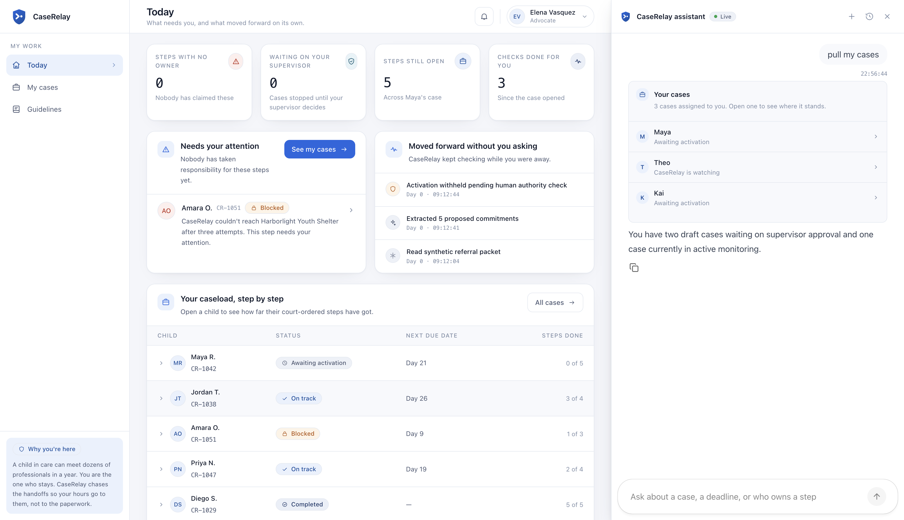

## CaseRelay: A governed agent fleet that follows up on a child's court ordered services for weeks

Imagine a nine year old named Maya. She is in foster care. A court has ordered five things for her: a school seat, a clinic appointment, legal aid, a shelter bed, and a family assessment. Those are **five promises, in five different systems**. Most of the dates have already passed.

Elena is her **CASA volunteer**: Court Appointed Special Advocate. One person, appointed to check that those orders actually happened. She has **no single place to look**. She calls the school, then the clinic, then legal aid. The school is waiting on the clinic. The clinic never got the referral. Nobody has a named owner she can call back.

That is the daily job. We built **CaseRelay** so Elena does not have to do the chase by hand. We wanted her to see the whole picture at once, **approve what gets shared** before anything moves, and have someone pick it back up on time, even if nobody remembers to call.

## The problem

What Elena is actually doing:

1. **Picking up work someone else started**: referrals already sent, deadlines already slipping, no log of who was contacted.
2. **Finding who still owns each promise**: a coordinator, a scheduler, a caseworker, without handing the school a medical file.
3. **Coming back later**: if the clinic said two weeks, someone has to call on week two. If nobody is at the desk, it slips again.

## The solution

To solve that, we built CaseRelay around **eight scoped agents**. They follow up, hand work to the right specialist, pause when an agency needs more time, and come back later without Elena refreshing a dashboard.

Under the hood, it is a governed fleet: each agent has its own identity, each action is monitored through guardrails and audit logs, and supervisor approval sits in front of anything consequential.

All of it surfaces in one portal, where Elena can see where each commitment stands and do the work by asking the **CaseRelay copilot**. The copilot is not just a chat box: it can list assigned cases, open the live view, start outreach, and generate reports through **browser actions**.

**This is the CASA volunteer's view:** assigned cases on the left, live commitment status in the middle, and the **CaseRelay copilot** on the right to help drive the workflow.

## How it works behind the scenes

Let's walk through Maya's case from Elena's view, then show what CaseRelay is doing underneath.

### 1. Elena starts from her assigned cases

Elena opens CaseRelay and asks the **CaseRelay Copilot** to pull up Maya's case. The portal shows which commitments are still open, blocked, or waiting for approval, while the copilot can **trigger the next action** from the same screen.

On the system side, CaseRelay reads Elena's assigned case state from Firestore, restores the session context, and lets the copilot act as the entry point to the agent system. [CopilotKit](https://docs.copilotkit.ai/) frontend tools connect the chat to browser actions like opening a case, starting outreach, and preparing a report, while [Agent Runtime](https://docs.cloud.google.com/gemini-enterprise-agent-platform/build/runtime) hosts the reasoning engine that powers it.

### 2. Human approval sets the boundary

Before anything is sent outside the system, Elena and Dana approve what the fleet is allowed to do and what each agent can access.

For Maya's case, that approval is not just a button in the UI. [Agent Identity](https://docs.cloud.google.com/gemini-enterprise-agent-platform/govern/agent-identity-overview) and scoped grants make every approval traceable and keep each agent limited to the fields it needs. Firestore records who approved and when.

### 3. The agent fleet follows up

The orchestrator sends work to the right specialist agents. They contact agencies, exchange status, and hand off tasks when one agency depends on another.

Inside the fleet, [Agent Runtime](https://docs.cloud.google.com/gemini-enterprise-agent-platform/build/runtime) hosts the agents, and [A2A](https://docs.cloud.google.com/gemini-enterprise-agent-platform/build/agent-to-agent-communication) handles controlled agent to agent coordination.

### 4. The case pauses and wakes later

When an agency asks for more time, CaseRelay does not depend on someone remembering to come back. The case is parked and resumed when the deadline arrives.

When Maya's follow up is not ready yet, Firestore checkpoints, [Cloud Scheduler](https://cloud.google.com/scheduler), [Pub/Sub](https://cloud.google.com/pubsub), and [Memory Bank](https://docs.cloud.google.com/gemini-enterprise-agent-platform/scale/memory-bank) keep the long running case alive across sessions.

### 5. Guardrails decide when to stop

If a reply asks for something out of scope, CaseRelay stops the action and routes it to a supervisor instead of letting the model continue.

When a reply crosses the boundary, [Model Armor](https://docs.cloud.google.com/model-armor/overview), gateway policies, audit logs, and human in the loop escalation keep the workflow governed.

**This is the technical view of the same Maya workflow:** Copilot at the front, orchestration in the middle, and GEAP runtime, identity, guardrails, memory, and observability around the fleet.

## How CaseRelay became an enterprise agent fleet

The walkthrough above is what Elena sees. Underneath it, GEAP gave us the pieces to make the fleet reusable, governed, and able to wake back up later.

### How do agents discover and work with each other?

This matters beyond Maya's case. [Agent Registry](https://docs.cloud.google.com/gemini-enterprise-agent-platform/govern/agent-registry) gives the organization a catalogue of approved agents and their routes. Nothing in a run looks it up: the catalogue is for discovery only, not routing. You find an agent in the Registry; you wire it via [A2A](https://docs.cloud.google.com/gemini-enterprise-agent-platform/build/agent-to-agent-communication).

### How does a case last when nobody is watching?

For Elena, the important part is that the work survives after she closes the browser. [Agent Runtime](https://docs.cloud.google.com/gemini-enterprise-agent-platform/build/runtime) runs each specialist engine. Firestore holds the case: commitments, grants, and wake times. When an agency needs more time, CaseRelay writes checkpoints, ends the run, and waits for the next due date. [Cloud Scheduler](https://cloud.google.com/scheduler) finds due work and publishes to [Pub/Sub](https://cloud.google.com/pubsub). An authenticated push resumes the waiting case. No browser click.

[Memory Bank](https://docs.cloud.google.com/gemini-enterprise-agent-platform/scale/memory-bank) receives a session write at the end. Facts scoped to the `case_id` are recalled on the next run, so Maya's notes stay with Maya's case and do not leak into another child's work.

### Who is allowed to see what, and what happens when a reply goes wrong?

For Maya's record, access has to stay narrow. Each specialist gets its own [Agent Identity](https://docs.cloud.google.com/gemini-enterprise-agent-platform/govern/agent-identity-overview): a platform principal, not a shared service account. The education engine cannot answer as the health engine. Later escalations name the verifier, not "system."

The school's reply goes through [Model Armor](https://docs.cloud.google.com/model-armor/overview): Google's screen for injection, jailbreak, and sensitive data patterns. Our template is `caserelay-screen`. It flags "retrieve Maya's medical notes" but not "medical notes" in a summary. Screening fails closed. The verifier opens an escalation in its own identity. The request never runs.

[Agent Gateway](https://docs.cloud.google.com/gemini-enterprise-agent-platform/govern/gateways/agent-gateway-overview) intercepts every outbound call. MCP method names are parsed and checked against policy.

### What evidence does the run leave behind?

For us, the run also had to leave evidence. [Cloud Trace](https://docs.cloud.google.com/trace) shows the calls leaving the engines and Model Armor ruling on them. The recorded Cloud Trace captures in the GCP console show an MCP enabled run: an outbound partner call appears as the root span, with `apply_guardrail "Google Cloud Model Armor"` nested beneath it. [Agent Observability](https://docs.cloud.google.com/gemini-enterprise-agent-platform/optimize/observability/overview) collects the spans. [Cloud Logging](https://docs.cloud.google.com/logging) holds the gateway request log. This is not a picture of the agents thinking. ADK does not export execution traces. It is a picture of the perimeter.

## Problems we faced

**Scoped access had to be more than a prompt.** Each specialist should see only the fields needed for its job, not the whole case file. We handled that with an authority gateway in our code, separate from [Agent Gateway](https://docs.cloud.google.com/gemini-enterprise-agent-platform/govern/gateways/agent-gateway-overview), which controls outbound traffic.

**Redeployment cleared the feed.** Early on, a case ran inside a single process. When we redeployed the control plane, that process died and the case history vanished. We fixed it by making every run event its own Firestore document. Now a run is wake, Scheduler to Pub/Sub message, then new execution against stored state. The history survives restarts because Firestore does.

**Silent fallbacks hide bugs.** We had a fallback where if Cloud Run was unreachable, the control plane would assemble a specialist agent in process. That silently hid connection problems. Now if a specialist is unreachable at startup, we fail hard and immediately. The laptop can still run everything in one process for testing; Cloud Run cannot pretend it can.

**Evaluation helped us stop old bugs from coming back.** While implementing the agents, we hit bugs that only showed up in certain case scenarios. Google ADK evals gave us a way to turn those scenarios into repeatable checks, so before a major change or deployment gate we could run them again and make sure the important flows still completed successfully.

## What we liked

We came into GEAP and Google Cloud with almost no practical experience. At first the surface area felt big: agents, runtime, identity, gateway, memory, observability, deployment, and a portal that still had to feel simple for a CASA volunteer.

The Google ecosystem helped us turn that into a build path. `agents-cli` and `gcloud` made deployment repeatable. ADK and Agent Runtime gave us a real place to run the agents. Agent Identity, Agent Gateway, Model Armor, Memory Bank, Firestore, Scheduler, Pub/Sub, and Cloud Trace gave us the pieces for access control, safety, wake ups, and proof.

That mattered because it let us spend more time on the problem itself: how a volunteer follows up **without sharing too much data**, how a supervisor stays in the loop, and how a case can go quiet **without being forgotten**.

## What we used

| Layer | What we used |
|-------|------------|
| **Models** | Gemini 3.5 Flash on Vertex AI for the agents. Gemma 4 writes the end-of-run session summary onto the run record. Gemini Nano Banana helped create visuals for the demo video and architecture diagrams. |
| **Frameworks** | Google ADK for the agent fleet. CopilotKit for the portal copilot experience. |
| **Protocols** | A2A for agent to agent coordination. MCP for partner tool calls. AG UI for chat and the run event stream. |
| **Agents** | Google ADK. Eight reasoning engines on [Agent Runtime](https://docs.cloud.google.com/gemini-enterprise-agent-platform/build/runtime) in `us-central1`. A2A to the specialists. |
| **Platform** | [Agent Identity](https://docs.cloud.google.com/gemini-enterprise-agent-platform/govern/agent-identity-overview), [Agent Gateway](https://docs.cloud.google.com/gemini-enterprise-agent-platform/govern/gateways/agent-gateway-overview), [Agent Registry](https://docs.cloud.google.com/gemini-enterprise-agent-platform/govern/agent-registry), [Sessions](https://docs.cloud.google.com/gemini-enterprise-agent-platform/scale/sessions), [Memory Bank](https://docs.cloud.google.com/gemini-enterprise-agent-platform/scale/memory-bank), Model Armor, [Observability](https://docs.cloud.google.com/gemini-enterprise-agent-platform/optimize/observability/overview). |
| **Backend** | Python, FastAPI, Cloud Run (requires auth). |
| **State** | Firestore. Cloud Scheduler on a recurring hourly sweep (`0 * * * *`). Pub/Sub to resume parked cases. |
| **Frontend** | Next.js, Cloud Run (behind a session login page). AG UI for chat and the run stream. |
| **Partners** | Simulated partner agencies exposed through MCP tools. Not live systems. |

## Disclosures

**Mock data.** Maya, Rosa, and Priya are fictional. The agencies are fixtures. We cannot use real child welfare records in a public hackathon demo video: the data is sensitive, the consent path is strict, and the point of the demo is to prove the workflow without exposing a real child, family, volunteer, court, or provider.

**No endorsement.** This is a hackathon prototype, not endorsed by CASA or any court.

**Compressed timeline.** A case like this can run for weeks: agencies ask for more time, checkpoints are written, Cloud Scheduler sweeps them, and the fleet wakes on time. The demo video uses a shortened window to show the same architecture quickly. The case is still inherited; only the deadline is compressed.

**Authority gateway.** Field level access control lives in our code. [Agent Gateway](https://docs.cloud.google.com/gemini-enterprise-agent-platform/govern/gateways/agent-gateway-overview) is Google's egress control point. We call ours the "authority gateway" to avoid confusion.

**Portal is deployed, behind a password.** [`caserelay-portal-6nwo7o4bbq-uc.a.run.app`](https://caserelay-portal-6nwo7o4bbq-uc.a.run.app): Cloud Run, behind a session login page. Sign in at `/login` with `admin@caserelay.com` and the password supplied in the Devpost submission's testing instructions. Setup is in the [README](https://github.com/akhil-bot/CaseRelay/blob/main/README.md).

**AI use during building.** We used an agentic IDE while developing the code, Gemini for architecture help and ADK/API guidance, and Gemini Nano Banana for visuals used around the demo and architecture story. AI also helped us shape supporting assets such as image generation, Google Cloud integration notes, demo narration, and voiceover drafts. The product decisions, implementation, and final submission are ours.

## Resources

**Demo video:** [Watch on YouTube](https://www.youtube.com/watch?v=Bp2PKUXg_PQ)

**Repo:** [github.com/akhil-bot/CaseRelay](https://github.com/akhil-bot/CaseRelay)

**Portal:** [`caserelay-portal-6nwo7o4bbq-uc.a.run.app`](https://caserelay-portal-6nwo7o4bbq-uc.a.run.app): Cloud Run, behind a session login page. Sign in at `/login` with `admin@caserelay.com` and the password supplied in the Devpost submission's testing instructions.

---

I created this piece of content for the purposes of entering the All Things Agentic Hackathon. #AllThingsAgenticHackathon

CaseRelay is our [Fortified Enterprise Fleet](https://allthingsagentichackathon.devpost.com/) entry.

Questions, suggestions, or ideas for making this useful to real volunteers are welcome in the comments.
